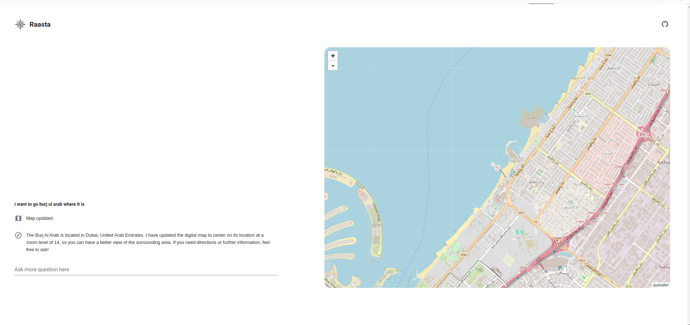

# Raasta


Raasta is a collaborative map-based chat application powered by OpenAI's GPT-4.

## Features

- **Map Interface**: Visualize locations in real-time with an interactive map.- Live previews
- **Chat Interface**: Engage in conversations and perform map-related actions seamlessly.
- **OpenAI Integration**: Utilizes GPT-4 to enhance user experience and perform map operations via conversational commands.


## Installation

To run Raasta locally, follow these steps:

```bash
   git clone https://github.com/MuhammadNasarUddin/raasta.git
   cd raasta
   pip install -r requirements.txt
```
    

